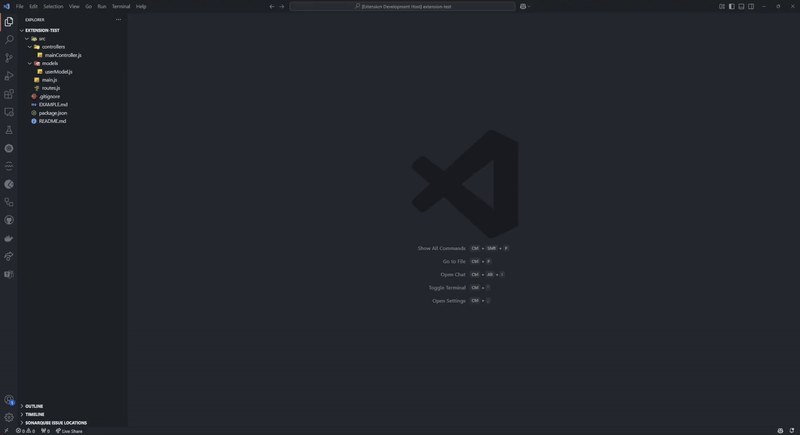

# Copy Project Context for AI

An easy-to-use Visual Studio Code extension that allows you to quickly copy your project's structure and files, making it convenient to use as context for interacting with your favorite AI model or other purposes.

## Why Use This Extension?

Explaining your project's structure, state, and technologies to an AI model can be time-consuming. This extension helps by allowing you to copy the project structure and files directly from the VS Code explorer. The project structure can provide valuable information about the type of project, its current state, the technologies used, and general information about it. Sometimes, this is all an AI needs to better understand your project's problems, errors, and questions.

## Example



## Features

- **Easy File Selection**: Right-click any file and select "Add to Context" to include it in your clipboard collection.
- **Smart Language Detection**: Automatically detects and formats code blocks based on file extensions:
  - `.ts` → ```typescript
  - `.js` → ```javascript
  - `.json` → ```json
  - `.md` → ```markdown
  - `.py` → ```python
  - `.html` → ```html
  - `.css` → ```css
  - Other files → ```plaintext

- **Bulk Copy**: Right-click any folder to "Copy Project Context" and get all selected files formatted and ready to paste.
- **Clean Output**: Files are wrapped in appropriate language code blocks, perfect for documentation or AI interactions.

## Usage

1. **Adding Files to Context**:
   - Right-click any file in the explorer.
   - Select "Add File Content to Project Context".
   - Repeat for all files you want to include.

2. **Removing Files of Context**:
   - Right-click any file in the explorer.
   - Select "Remove File Content from Project Context".
   - Repeat for all files you want to remove.

3. **Copying Project Context**:
   - Right-click any folder or empty space in the explorer.
   - Select "Copy Project Context".
   - All previously added files will be formatted and copied to your clipboard.

4. **Pasting**:
   - Use Ctrl+V (Cmd+V on macOS) anywhere to paste your formatted context.
   - Each file will be properly formatted with language-specific code blocks.

```markdown
# Project Structure
├── src
│   ├── extension.ts
│   └── test
│       └── extension.test.ts
├── package.json
└── README.md

### File: src/extension.ts
```typescript
interface ContextFile {
    path: string;
    language: string;
}
```

## Known Issues

No known issues for now. Please submit issues on our GitHub repository.

## Support Me

If you find this extension helpful, consider supporting me by starring the repository on GitHub or sharing it with others.
